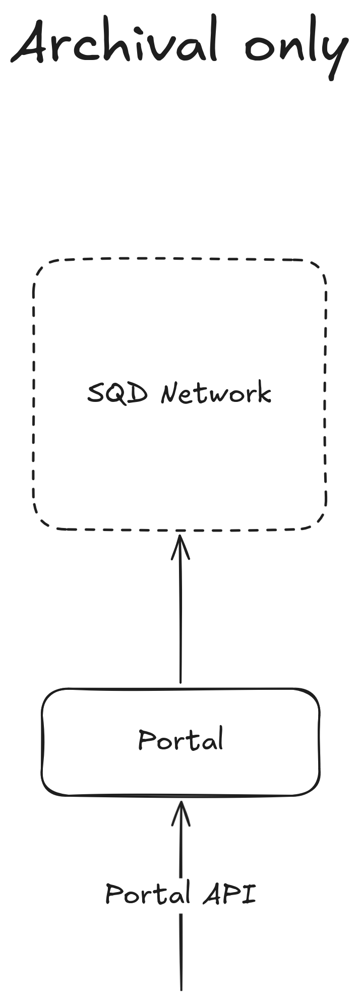
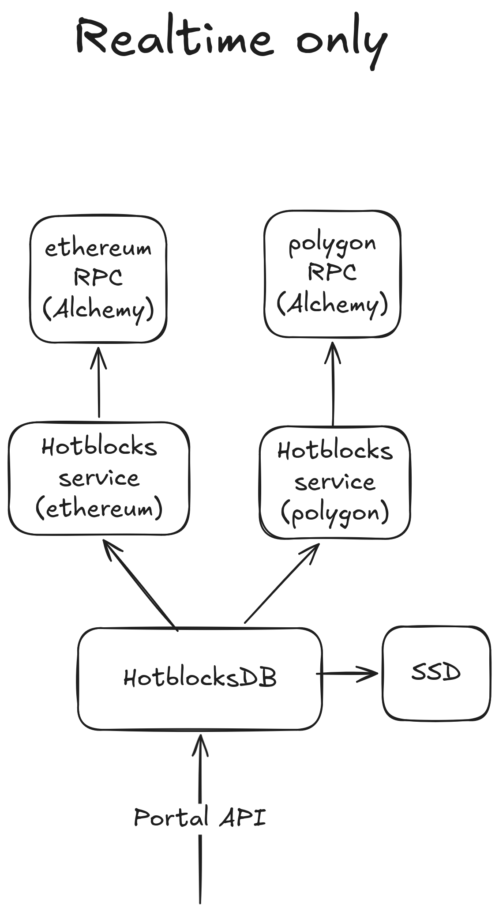
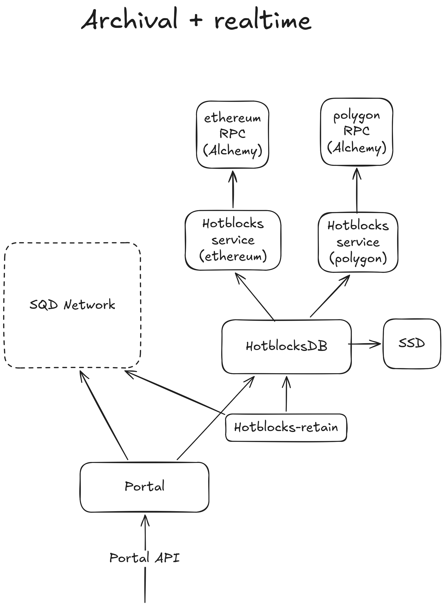
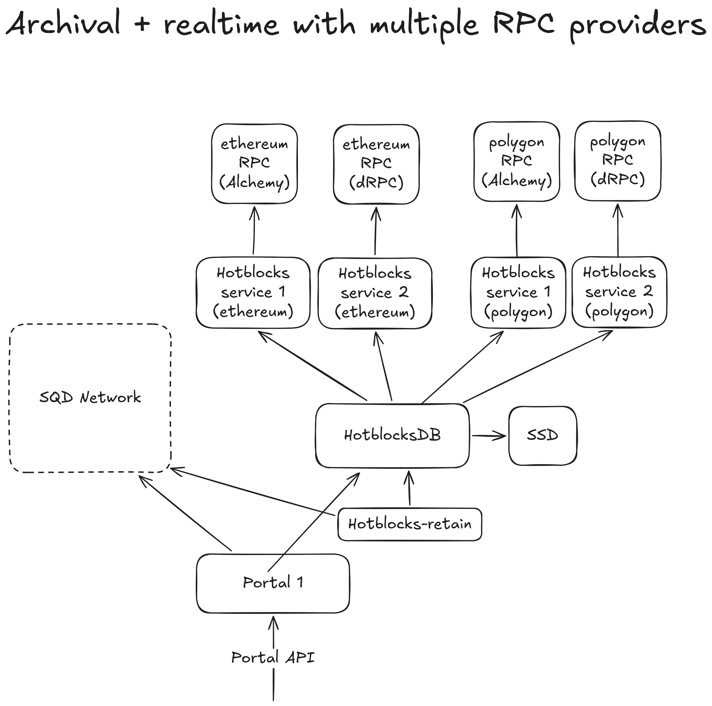
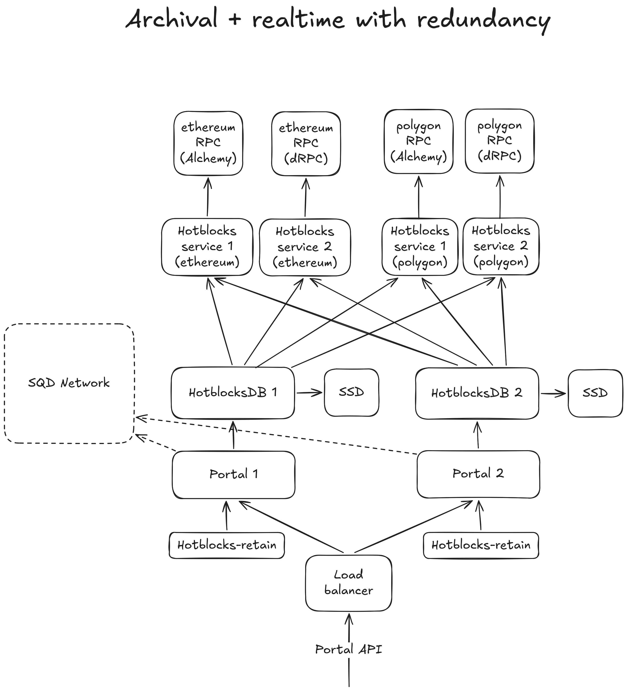

# Self hosting SQD Portal

## Data sources

### SQD Network — archival data

Data up to the few latest hours, high throughput.

You have to lock at least 1,000,000 SQD tokens to get access.

If you don't have 1,000,000 SQD, you can [borrow it](https://network.sqd.dev/dashboard/portal-pools) from the community in exchange to regular stablecoin payouts.

### Realtime data

Last-mile data, low latency. You can buy a subscription from us, or self-host to get data from RPC.

## Software components

| Component | Image | Stateful | Source |
|-----------|-------|----------|--------|
| Portal | `subsquid/sqd-portal` | no | [sqd-portal](https://github.com/subsquid/sqd-portal) |
| HotblocksDB | `subsquid/data-hotblocks` | yes (local RocksDB) | [data/hotblocks](https://github.com/subsquid/data/tree/master/crates/hotblocks) |
| Hotblocks service | `subsquid/evm-data-service` | no | [evm-data-service](https://github.com/subsquid/squid-sdk/tree/master/evm/evm-data-service) |
| Hotblocks-retain | `subsquid/data-hotblocks-retain` | no | [data/hotblocks-retain](https://github.com/subsquid/data/tree/master/crates/hotblocks-retain) |

### Portal

Serves the [portal API](https://github.com/subsquid/specs/blob/main/network-rfc/11_portal_api.md) from SQD Network and, optionally, routes requests for the latest blocks to HotblocksDB.

Downloads a ~0.5 GB assignment file at startup and periodically re-downloads it. Needs an Arbitrum RPC endpoint (and an Ethereum L1 RPC) to read on-chain state.

Typical resources: 4 CPU / 4–5 GB RAM per replica.

### HotblocksDB

Storage for realtime data. Reads from hotblocks services, persists in local RocksDB, and serves the [portal API](https://github.com/subsquid/specs/blob/main/network-rfc/11_portal_api.md).

Each replica maintains its own RocksDB on local disk and ingests independently. Disk sizing depends on the retention window: production keeps ~768 GiB per replica for an `Api`-retention setup across all mainnet datasets; a single-chain sliding-window deployment fits in tens of GiB.

Typical resources: 8 CPU / 12–64 GB RAM.

### Hotblocks service

Data ingestion service. Fetches from the RPC via polling, validates, retries, and serves full blocks to HotblocksDB. One process per RPC endpoint.

In-memory buffer of the last ~1000 blocks. Modest resources and high network usage.

### Hotblocks-retain

Helper that polls SQD Network status and tells HotblocksDB to drop data once it becomes available in the archive. Required for `Api` retention — HotblocksDB does not start ingesting a dataset until it has received a retention update for it.

## Setups for different use cases

### Archival only

Suitable when:
- you want to backfill data quickly
- you have 1M SQD tokens either on your wallet or borrowed

Not suitable when:
- you can't tolerate a few hours lag behind the head
- you can't tolerate downtime



**1. Generate a peer id** and register it in the [Network App](https://network.subsquid.io/portals):

```bash
docker run -u $(id -u):$(id -g) -v .:/cwd subsquid/keygen:latest /cwd/portal.key
```

**2. Portal config** (`mainnet.config.yml`):

```yaml
hostname: http://0.0.0.0:8080
sqd_network:
  datasets: https://cdn.subsquid.io/sqd-network/datasets.yml
  metadata: https://cdn.subsquid.io/sqd-network/mainnet/metadata.yml
  serve: "all"
```

**3. Save** [`mainnet.env`](https://github.com/subsquid/sqd-portal/blob/main/mainnet.env) (boot nodes + RPC URLs) **as `.env`** in the working directory.

**4. Run the portal:**

```bash
docker run --rm \
  --env-file .env \
  -e KEY_PATH=/keys/portal.key \
  -e HTTP_LISTEN_ADDR=0.0.0.0:8080 \
  -v $PWD/portal.key:/keys/portal.key \
  -v $PWD/mainnet.config.yml:/run/mainnet.config.yml \
  -p 8080:8080 \
  subsquid/sqd-portal:latest
```

More on https://docs.sqd.dev/en/portal/self-hosting.

### Realtime only

Suitable when:
- you have an RPC node access with high enough rate limit
- you don't want to pay anything
- you need latest blocks or the entire chain is small enough

Not suitable when:
- you can't tolerate downtime, including RPC downtime



End-to-end docker-compose example: https://github.com/subsquid/sqd-portal/tree/main/examples/devnet-evm

**1. Hotblocks service** — one per RPC endpoint. Selectivity flags are fixed at startup; enable only what your queries actually need (`--traces` and `--diffs` require `debug_traceBlockByHash` support on the RPC):

```bash
docker run --rm -p 3000:3000 subsquid/evm-data-service:latest \
  --http-rpc "$RPC_URL" \
  --receipts \
  --traces \
  --diffs --use-debug-api-for-statediffs \
  --block-cache-size 1000
```

**2. HotblocksDB** — point at all hotblocks-service instances of the dataset. Pick a retention that fits the disk:

```yaml
# config.yaml
my-devnet:
  kind: evm
  retention_strategy:
    Head: 2000          # sliding window of N latest blocks
    # FromBlock: { number: 0 }   # everything from block N (use only if it fits on disk)
  data_sources:
    - http://hotblocks-service-1:3000
    - http://hotblocks-service-2:3000
```

```bash
docker run --rm -p 8081:8081 -v $PWD/config.yaml:/app/config.yaml -v db:/run/db \
  subsquid/data-hotblocks:latest \
  --datasets /app/config.yaml --db /run/db --port 8081
```

HotblocksDB already serves the portal API on its port, so no portal is needed in this setup — clients query HotblocksDB directly.

**3. Verify:**

```bash
curl localhost:8081/datasets/my-devnet      # expect real_time: true
curl localhost:8081/datasets/my-devnet/stream --compressed -d '{
  "type":"evm","fromBlock":0,"includeAllBlocks":true,
  "fields":{"block":{"number":true,"hash":true,"timestamp":true}}
}'
```

There is a dedicated docs page: https://docs.sqd.dev/en/data/evm-local-setup/overview

### Archival + realtime

Suitable when:
- you have 1M SQD tokens either on your wallet or borrowed
- you want full datasets — backfilling and then staying on top of the head
- you have an RPC node access with high enough rate limit

Not suitable when:
- you can't tolerate downtime, including RPC downtime
- latency is critical, but RPC sometimes lags behind (see the next case)



**1. Hotblocks service** — one per RPC endpoint. Selectivity flags are fixed at startup; enable only what your queries actually need (`--traces` and `--diffs` require `debug_traceBlockByHash` support on the RPC):

```bash
docker run --rm -p 3000:3000 subsquid/evm-data-service:latest \
  --http-rpc "$RPC_URL" \
  --receipts \
  --traces \
  --diffs --use-debug-api-for-statediffs \
  --block-cache-size 1000
```

**2. HotblocksDB** — use `Api` retention. HotblocksDB will wait until hotblocks-retain calls `/datasets/<dataset>/retention` before it starts pulling data:

```yaml
# config.yaml
ethereum-mainnet:
  kind: evm
  retention_strategy: Api
  data_sources:
    - http://hotblocks-service-1:3000
```

```bash
docker run --rm -p 8081:8081 -v $PWD/config.yaml:/app/config.yaml -v db:/run/db \
  subsquid/data-hotblocks:latest \
  --datasets /app/config.yaml --db /run/db --port 8081
```

**3. Hotblocks-retain.** Its `datasets.yaml` is a plain list of dataset names that should be tracked:

```yaml
# datasets.yaml
datasets:
  - ethereum-mainnet
```

```bash
docker run --rm -v $PWD/datasets.yaml:/cfg/datasets.yaml \
  subsquid/data-hotblocks-retain:latest \
  --hotblocks-url http://hotblocks-db:8081 \
  --status-url https://metadata.sqd-datasets.io/scheduler/mainnet/status.json \
  --datasets-url https://cdn.subsquid.io/sqd-network/datasets.yml \
  --datasets-config /cfg/datasets.yaml
```

**4. Generate a peer id** and register it on-chain (e.g. in the [Network App](https://network.subsquid.io/portal)):

```bash
docker run -u $(id -u):$(id -g) -v .:/cwd subsquid/keygen:latest /cwd/portal.key
```

**5. Portal config** (`mainnet.config.yml`) — declare both the SQD Network archive and HotblocksDB for each realtime dataset:

```yaml
hostname: http://0.0.0.0:8080
hotblocksDB: http://hotblocks-db:8081
sqd_network:
  datasets: https://cdn.subsquid.io/sqd-network/datasets.yml
  metadata: https://cdn.subsquid.io/sqd-network/mainnet/metadata.yml
  serve: "manual"
datasets:
  ethereum-mainnet:
    real_time:
      kind: evm
```

**6. Save** [`mainnet.env`](https://github.com/subsquid/sqd-portal/blob/main/mainnet.env) (boot nodes + RPC URLs) **as `.env`** in the working directory.

**7. Run the portal:**

```bash
docker run --rm \
  --env-file .env \
  -e KEY_PATH=/keys/portal.key \
  -e HTTP_LISTEN_ADDR=0.0.0.0:8080 \
  -v $PWD/portal.key:/keys/portal.key \
  -v $PWD/mainnet.config.yml:/run/mainnet.config.yml \
  -p 8080:8080 \
  subsquid/sqd-portal:latest
```

**8. Verify:** `curl localhost:8080/datasets/ethereum-mainnet` should report `real_time: true` and `start_block: 0`.

### Archival + realtime with multiple RPC providers

Suitable when:
- you already have the ["archival + realtime"](#archival--realtime) setup
- you want to tolerate RPC downtime/lags

Not suitable when:
- you can't tolerate the portal downtime, e.g. restarts



Run one hotblocks service per RPC endpoint and list them all under `data_sources:` in HotblocksDB:

```yaml
ethereum-mainnet:
  kind: evm
  retention_strategy: Api
  data_sources:
    - http://hotblocks-service-dwellir:3000
    - http://hotblocks-service-drpc:3000
    - http://hotblocks-service-uniblock:3000
```

### Archival + realtime with redundancy

Sutable when:
- you already have the ["archival + realtime"](#archival--realtime) setup
- you want to have at least 99.9% uptime



Run multiple pods, each containing HotblocksDB + hotblocks-retain + portal, behind a load balancer. Each HotblocksDB replica holds its own RocksDB on local disk and ingests independently from the shared hotblocks services — size disks accordingly.
